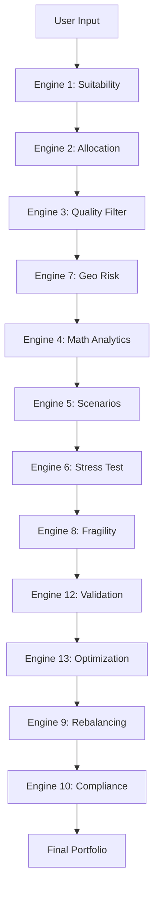

# 🚀 13-Engine ETF Investment System for Indian Markets

[](https://www.python.org/)
[](LICENSE)
[]()

An advanced, production-grade quantitative portfolio construction system designed specifically for Indian ETF markets. This system employs 13 distinct analytical engines across 3 phases to build optimized, personalized investment portfolios.

## 📋 Table of Contents

- [Overview](#overview)
- [Features](#features)
- [Architecture](#architecture)
- [Installation](#installation)
- [Usage](#usage)
- [System Workflow](#system-workflow)
- [ETF Universe](#etf-universe)
- [Technical Details](#technical-details)
- [Example Output](#example-output)
- [Contributing](#contributing)
- [License](#license)

## 🎯 Overview

The **13-Engine ETF Investment System** is a comprehensive portfolio construction platform that combines traditional financial theory with modern quantitative techniques. It analyzes 20+ real Indian ETFs from NSE/BSE and constructs personalized portfolios based on:

- User risk tolerance and investment horizon
- Market regime and macroeconomic conditions
- Quality metrics (liquidity, tracking error, expense ratios)
- Quantitative risk analytics (Sharpe ratio, volatility, drawdown)
- Scenario analysis and stress testing
- Geopolitical risk factors

## ✨ Features

### Core Capabilities

- **🎯 Personalized Risk Profiling**: Customizable based on age, experience, and risk tolerance (1-10 scale)
- **📊 Real Indian ETF Data**: Analyzes 20+ actual ETFs including NIFTYBEES, GOLDBEES, BANKBEES, etc.
- **🔍 Multi-Phase Analysis**: 13 specialized engines across 3 analytical phases
- **📈 Portfolio Optimization**: Mean-variance optimization with custom constraints
- **⚡ Stress Testing**: Monte Carlo simulations and market crash scenarios
- **🌍 Geopolitical Risk Assessment**: Global risk factor integration
- **✅ Compliance Checks**: Automated regulatory and constraint validation

### Advanced Features

- Experience-based constraint adjustment (Beginner to Expert)
- Custom portfolio constraints (max position size, min diversification)
- Market regime detection (Risk-On/Risk-Off/Neutral)
- Quality filtering (liquidity, tracking error, expense ratio)
- Fragility scoring system (0-100 scale)
- Rebalancing signal generation

## 🏗️ Architecture

The system is organized into **3 Phases** with **13 Engines**:

### **Phase 1: Foundation**
```
Engine 1  → User Suitability Analysis
Engine 2  → Strategic Allocation (Market Regime)
Engine 3  → Quality Screening & Filtering
Engine 7  → Geopolitical Risk Assessment
```

### **Phase 2: Intelligence**
```
Engine 4  → Quantitative Risk Analytics
Engine 5  → Monte Carlo Scenario Analysis
Engine 6  → Stress Testing & Crisis Simulation
```

### **Phase 3: Portfolio Construction**
```
Engine 8  → Fragility Assessment
Engine 9  → Rebalancing Analysis
Engine 10 → Regulatory Compliance
Engine 12 → Constraint Validation & Backtesting
Engine 13 → Portfolio Optimization
```

## 📦 Installation

### Prerequisites

- Python 3.8 or higher
- pip package manager

### Dependencies
```bash
pip install numpy pandas scipy
```

### Clone Repository
```bash
git clone https://github.com/yourusername/13-engine-etf-system.git
cd 13-engine-etf-system
```

### Install Requirements
```bash
pip install -r requirements.txt
```

## 🚀 Usage

### Basic Usage
```bash
python etf_investment_system.py
```

### Interactive Input

The system will prompt you for:

1. **Age** (18-100 years)
2. **Risk Score** (1-10 scale)
   - 1-2: Very Conservative
   - 3-4: Conservative
   - 5-6: Moderate
   - 7-8: Aggressive
   - 9-10: Very Aggressive
3. **Investment Horizon** (1-50 years)
4. **Experience Level**
   - Beginner (0-2 years)
   - Intermediate (2-5 years)
   - Advanced (5-10 years)
   - Expert (10+ years)
5. **Custom Constraints**
   - Max single ETF position (5-60%)
   - Minimum diversification (2-15 ETFs)

### Example Session
```
[1/5] Enter your Age: 28
[2/5] Enter your Risk Score (1-10): 8
[3/5] Enter your Investment Horizon (years): 15
[4/5] Select your Experience Level (1-4): 2
[5a] Max Single ETF Position % (default 25%, max 60%): 30
[5b] Minimum Number of ETFs (default 5, min 2): 6
```

## 🔄 System Workflow


## 📊 ETF Universe

The system analyzes **20 real Indian ETFs** across three asset classes:

### Equity ETFs
- **NIFTYBEES** - Nippon India ETF Nifty BeES
- **JUNIORBEES** - Nippon India ETF Junior BeES
- **BANKBEES** - Nippon India ETF Bank BeES
- **SETFNIF50** - SBI ETF Nifty 50
- **CPSEETF** - CPSE ETF
- **ITETF** - Nippon India ETF IT
- **PSUBNKBEES** - Nippon India ETF PSU Bank
- **CONSUMBEES** - Nippon India ETF Consumption
- **AUTOBEES** - Nippon India ETF Auto
- **PHARMABEES** - Nippon India ETF Pharma
- **INFRABEEX** - Nippon India ETF Infra
- **MOM50** - Motilal Oswal M50 ETF
- **NETF** - Nippon India ETF Nifty Next 50
- **HDFCNIF100** - HDFC Nifty 100 ETF
- **SETFNN50** - SBI ETF Nifty Next 50

### Bond ETFs
- **LIQUIDBEES** - Nippon India ETF Liquid BeES
- **ICICIB22** - ICICI Prudential Nifty Bond ETF
- **BBETF0423** - Bharat Bond ETF

### Commodity ETFs
- **GOLDBEES** - Nippon India ETF Gold BeES
- **SILVER** - Nippon India ETF Silver BeES

## 🔬 Technical Details

### Risk Metrics Calculated

- **Annualized Return**: Expected yearly return
- **Volatility**: Standard deviation of returns (annualized)
- **Sharpe Ratio**: Risk-adjusted return metric
- **Maximum Drawdown**: Largest peak-to-trough decline
- **Value at Risk (VaR)**: 95% confidence interval
- **Skewness**: Return distribution asymmetry
- **Kurtosis**: Tail risk measure

### Optimization Algorithm

- **Method**: Sequential Least Squares Programming (SLSQP)
- **Objective**: Minimize portfolio variance
- **Constraints**:
  - Weights sum to 100%
  - No short selling (weights ≥ 0)
  - Maximum single position limit
  - Minimum diversification requirement
  - Asset class allocation targets

### Quality Filters

| Filter | Threshold |
|--------|-----------|
| Minimum Daily Volume | 100,000 units |
| Maximum Tracking Error | 2.0% annually |
| Maximum Expense Ratio | 1.5% annually |

### Risk-Free Rate

- **India**: 6.5% (based on 10-year G-Sec yield)

## 📈 Example Output
```
============================================================
                FINAL PORTFOLIO SUMMARY
============================================================

✓✓✓ PORTFOLIO CONSTRUCTION SUCCESSFUL ✓✓✓

Recommended Portfolio (6 ETFs):
======================================================================
Rank  Ticker       Weight   Asset Class  ETF Name
----------------------------------------------------------------------
1     NIFTYBEES      22.50%  Equity       Nippon India ETF Nifty BeES
2     SETFNIF50      18.75%  Equity       SBI ETF Nifty 50
3     GOLDBEES       15.00%  Commodity    Nippon India ETF Gold BeES
4     LIQUIDBEES     25.00%  Bond         Nippon India ETF Liquid BeES
5     BANKBEES       12.50%  Equity       Nippon India ETF Bank BeES
6     ICICIB22        6.25%  Bond         ICICI Prudential Bond ETF
----------------------------------------------------------------------
      TOTAL         100.00%
======================================================================

======================================================================
                    PORTFOLIO METRICS
======================================================================
Expected Annual Return:       12.45%
Expected Volatility (Risk):   15.30%
Expected Sharpe Ratio:         0.42

======================================================================
                 ASSET CLASS BREAKDOWN
======================================================================
Equity      :  53.75% (3 ETFs)
Bond        :  31.25% (2 ETFs)
Commodity   :  15.00% (1 ETFs)
```

## 🛠️ Configuration

### Customization Options

You can modify the following parameters in the code:

#### Risk Profiles (Engine 1)
```python
self.risk_profiles = {
    1: {'max_dd': 0.05, 'max_vol': 0.05, 'min_sharpe': 1.5},
    # ... customize for each risk level 1-10
}
```

#### Quality Thresholds (Engine 3)
```python
self.min_avg_volume = 100000
self.max_tracking_error = 0.02
self.max_expense_ratio = 0.015
```

#### Stress Test Parameters (Engine 6)
```python
self.crash_magnitude = 0.30  # 30% market crash
```

#### Fragility Threshold (Engine 8)
```python
self.fragility_threshold = 80.0  # 0-100 scale
```

## 📚 Methodology

### Modern Portfolio Theory (MPT)

The system implements Harry Markowitz's Modern Portfolio Theory for optimization:

- **Efficient Frontier**: Identifies optimal risk-return tradeoffs
- **Mean-Variance Optimization**: Minimizes portfolio variance for given return
- **Diversification**: Reduces unsystematic risk through asset allocation

### Risk Parity Principles

- Equal risk contribution across asset classes
- Volatility-adjusted position sizing
- Correlation-aware portfolio construction

### Behavioral Finance Integration

- Experience-level adjustments prevent overconfidence
- Stress testing addresses loss aversion
- Geopolitical risk acknowledges psychological factors

## 🧪 Testing

### Run Unit Tests
```bash
python -m pytest tests/
```

### Validation Checks

The system includes automated validation for:
- ✅ Weight normalization (sum = 100%)
- ✅ No negative weights
- ✅ Single position limits
- ✅ Minimum diversification
- ✅ Constraint satisfaction

## 🤝 Contributing

Contributions are welcome! Please follow these steps:

1. Fork the repository
2. Create a feature branch (`git checkout -b feature/AmazingFeature`)
3. Commit your changes (`git commit -m 'Add some AmazingFeature'`)
4. Push to the branch (`git push origin feature/AmazingFeature`)
5. Open a Pull Request

### Development Guidelines

- Follow PEP 8 style guide
- Add docstrings to all functions
- Include unit tests for new features
- Update README.md for significant changes

## 📝 Roadmap

### Planned Features

- [ ] Real-time market data integration via NSE API
- [ ] Machine learning-based regime detection
- [ ] Tax optimization for Indian investors
- [ ] Multi-period rebalancing strategies
- [ ] Risk attribution analysis
- [ ] Performance attribution
- [ ] Backtesting framework with historical data
- [ ] Web-based dashboard interface
- [ ] Portfolio comparison tools
- [ ] Export to Excel/PDF reports

## ⚠️ Disclaimer

**This software is for educational and research purposes only.**

- Not financial advice or investment recommendation
- Past performance does not guarantee future results
- Consult a qualified financial advisor before investing
- Users are responsible for their investment decisions
- The authors assume no liability for financial losses

## 📄 License

This project is licensed under the MIT License - see the [LICENSE](LICENSE) file for details.

## 👥 Authors

- **Your Name** - *Initial work* - [YourGitHub](https://github.com/yourusername)

## 🙏 Acknowledgments

- Harry Markowitz for Modern Portfolio Theory
- NSE/BSE for ETF market data structure
- Anthropic Claude for development assistance
- Indian investment community for testing and feedback

## 📞 Contact

- **GitHub**: [@yourusername](https://github.com/yourusername)
- **Email**: your.email@example.com
- **LinkedIn**: [Your Profile](https://linkedin.com/in/yourprofile)

## 📊 Project Stats


---

**⭐ If you find this project useful, please consider giving it a star!**

---

*Built with ❤️ for the Indian investment community*
```

---

## **Additional Files to Include:**

### **requirements.txt**
```
numpy>=1.21.0
pandas>=1.3.0
scipy>=1.7.0
```

### **LICENSE** (MIT License)
```
MIT License

Copyright (c) 2024 [Your Name]

Permission is hereby granted, free of charge, to any person obtaining a copy
of this software and associated documentation files (the "Software"), to deal
in the Software without restriction, including without limitation the rights
to use, copy, modify, merge, publish, distribute, sublicense, and/or sell
copies of the Software, and to permit persons to whom the Software is
furnished to do so, subject to the following conditions:

The above copyright notice and this permission notice shall be included in all
copies or substantial portions of the Software.

THE SOFTWARE IS PROVIDED "AS IS", WITHOUT WARRANTY OF ANY KIND, EXPRESS OR
IMPLIED, INCLUDING BUT NOT LIMITED TO THE WARRANTIES OF MERCHANTABILITY,
FITNESS FOR A PARTICULAR PURPOSE AND NONINFRINGEMENT. IN NO EVENT SHALL THE
AUTHORS OR COPYRIGHT HOLDERS BE LIABLE FOR ANY CLAIM, DAMAGES OR OTHER
LIABILITY, WHETHER IN AN ACTION OF CONTRACT, TORT OR OTHERWISE, ARISING FROM,
OUT OF OR IN CONNECTION WITH THE SOFTWARE OR THE USE OR OTHER DEALINGS IN THE
SOFTWARE.
```

### **.gitignore**
```
# Python
__pycache__/
*.py[cod]
*$py.class
*.so
.Python
build/
develop-eggs/
dist/
downloads/
eggs/
.eggs/
lib/
lib64/
parts/
sdist/
var/
wheels/
*.egg-info/
.installed.cfg
*.egg

# Virtual Environment
venv/
ENV/
env/

# IDE
.vscode/
.idea/
*.swp
*.swo

# OS
.DS_Store
Thumbs.db

# Project specific
*.csv
*.xlsx
output/
logs/
```

---

**Your repository structure should look like this:**
```
13-engine-etf-system/
├── README.md
├── LICENSE
├── requirements.txt
├── .gitignore
├── etf_investment_system.py
└── screenshots/
    └── example_output.png (optional)
